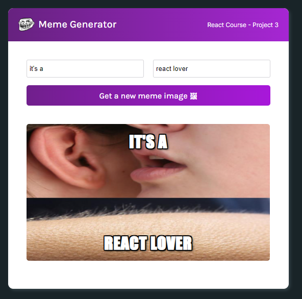

# Meme-Generator

This project is a meme generator using React and an API to render a random meme everytime a button is clicked. You can also write on the meme using two inputs.

### [You can check the app here!](https://tiny-pothos-4382eb.netlify.app/)




## Getting Started

These instructions will get you a copy of the project up and running on your local machine for development and testing purposes.

### Prerequisites

You should have npm installed on your machine 

### Installing

Clone this repository and run the following command inside the project folder

```
npm install
```

This will install all the dependencies you need to run the project.

### Running the project

Once all the dependencies are installed, run the following command

```
npm start
```

This will start the project on your default browser.

## Built With

* [React](https://reactjs.org/) - The web framework used
* [API](https://api.imgflip.com/get_memes) - API used to generate the memes

## Author

* **Youssef EL-OTHMANI** - [Youssef-404](https://github.com/Youssef-404)

## Acknowledgments

* scrimba react course